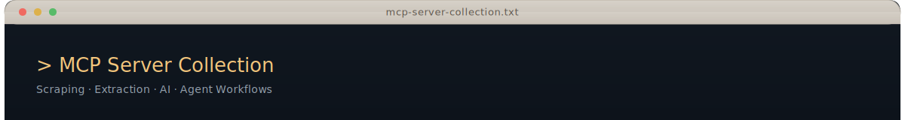

<div align="center">
  
</div>

<br>

## Overview

This repository contains a collection of purpose-built [Model Context Protocol](https://modelcontextprotocol.io/) servers, each designed around a specific capability: web scraping and structured data extraction, codebase navigation and analysis, LLM-powered text generation, and JSON querying. Every server exposes its functionality as MCP tools and resources, making them composable building blocks for AI agent workflows.

The servers span two language ecosystems — TypeScript for the Firecrawl integration and DeepSeek/JSON servers, Python for the codebase analysis server — and follow the MCP SDK conventions for tool definitions, resource URIs, and transport configuration (stdio and HTTP).

<br>

## Technology Stack

<table>
<tr>
<td><strong>Languages</strong></td>
<td>  </td>
</tr>
<tr>
<td><strong>MCP Framework</strong></td>
<td> </td>
</tr>
<tr>
<td><strong>Web Scraping</strong></td>
<td> </td>
</tr>
<tr>
<td><strong>AI Integration</strong></td>
<td> </td>
</tr>
<tr>
<td><strong>Data & Querying</strong></td>
<td> </td>
</tr>
<tr>
<td><strong>Runtime</strong></td>
<td> </td>
</tr>
<tr>
<td><strong>Tooling</strong></td>
<td>   </td>
</tr>
</table>

<br>

## Server Index

| Server | Language | Transport | Tools | Resources | Description |
|:-------|:---------|:----------|:------|:----------|:------------|
| [**Firecrawl Web Scraping**](#firecrawl-web-scraping-server) | TypeScript | stdio | 10 | &mdash; | Web scraping, crawling, batch processing, LLM extraction, deep research, and cannabis strain data extraction |
| [**Codebase Analysis**](#codebase-analysis-server) | Python | stdio | 6 | 4 | File system navigation, code search, project structure analysis, and real-time change monitoring |
| [**DeepSeek R1**](#deepseek-r1-server) | JavaScript | stdio | 5 | 5 | Text generation, summarization, streaming, multi-model support, and document processing via DeepSeek AI |
| [**JSON Manager**](#json-manager-server) | JavaScript | stdio / HTTP | 4 | 4 | JSONPath querying, advanced filtering, dataset comparison, and result caching |

<br>

---

## Firecrawl Web Scraping Server

A comprehensive MCP server built on the [Firecrawl](https://github.com/mendableai/firecrawl) platform for web scraping, content extraction, and structured data collection. Extends the base Firecrawl capabilities with a specialized cannabis strain data extraction pipeline that collects 66 standardized data points per strain from Leafly.com using dual extraction strategies: regex-based pattern matching and LLM-powered schema extraction.

### Tools

| Tool | Description |
|:-----|:------------|
| `firecrawl_scrape` | Scrape a single page with format selection (markdown, HTML, screenshots), custom actions, and content filtering |
| `firecrawl_map` | Discover all URLs on a website and generate a site map |
| `firecrawl_crawl` | Recursively crawl a website with depth and page limits |
| `firecrawl_batch_scrape` | Scrape multiple URLs concurrently with queue-based processing |
| `firecrawl_check_batch_status` | Poll the status of an in-progress batch scrape job |
| `firecrawl_check_crawl_status` | Poll the status of an in-progress crawl job |
| `firecrawl_search` | Search the web and return scraped content from results |
| `firecrawl_extract` | LLM-powered structured data extraction using a caller-defined JSON schema |
| `firecrawl_deep_research` | Multi-step research workflow that scrapes, synthesizes, and reports on a topic |
| `firecrawl_leafly_strain` | Extract standardized cannabis strain data (cannabinoids, terpenes, effects, flavors, interactions) |

### Strain Data Extraction Pipeline

The Leafly strain extractor is the most specialized component in this collection. It implements two complementary extraction strategies against the same data source:

**Regex-based extraction** parses raw HTML/markdown content with pattern-matching rules for cannabinoid percentages, terpene profiles, effect ratings, and flavor descriptors. This approach is deterministic and fast, but brittle against layout changes.

**LLM-powered extraction** uses Firecrawl's `extract` endpoint to send page content to an LLM with a structured JSON schema. This approach handles unstructured text, formatting variations, and missing data more gracefully, at the cost of API latency and token usage.

Both strategies normalize output to a consistent schema covering:

| Category | Fields |
|:---------|:-------|
| **Cannabinoids** | THC, CBD, CBG, CBN |
| **Terpenes** | Myrcene, Pinene, Caryophyllene, Limonene, Linalool, Terpinolene, Ocimene, Humulene |
| **Medical Effects** | Stress, Anxiety, Depression, Pain, Insomnia, Lack of Appetite, Nausea |
| **User Effects** | Happy, Euphoric, Creative, Relaxed, Uplifted, Energetic, Focused, Sleepy, Hungry, Talkative, Tingly, Giggly |
| **Adverse Effects** | Dry Mouth, Dry Eyes, Dizzy, Paranoid, Anxious |
| **Flavors** | Berry, Sweet, Earthy, Pungent, Pine, Vanilla, Minty, Skunky, Citrus, Spicy, Herbal, Diesel, Tropical, Fruity, Grape |
| **Pharmacokinetics** | Onset (minutes), Duration (hours) |
| **Drug Interactions** | Sedatives, Benzodiazepines, SSRIs, Opioid Analgesics, Anticonvulsants, Anticoagulants |

**Normalization methodology**: lab-tested data is prioritized. When exact values are unavailable, standardized normalization is applied (dominant terpene = 0.008, second = 0.005, third = 0.003). Effects and flavors are normalized to a 0.0&ndash;1.0 scale.

### Quick Start

```bash
cd firecrawl-mcp-server
npm install
cp .env.example .env          # Add your FIRECRAWL_API_KEY
npm run build
npm start                     # Start the MCP server (stdio transport)
```

```bash
# CLI: extract strain data directly
npm run scrape-leafly -- output.csv "Blue Dream,OG Kush,Sour Diesel"
```

<br>

---

## Codebase Analysis Server

A Python MCP server for navigating and analyzing codebases. Provides file system access, text search, function discovery, dependency analysis, and real-time file change monitoring via watchdog. Built with the Python MCP SDK's `FastMCP` framework.

### Tools

| Tool | Description |
|:-----|:------------|
| `search_function` | Find function definitions across Python, JavaScript, and TypeScript files |
| `search_code` | Full-text search across all code files in a directory tree |
| `get_project_structure` | Generate a tree-view representation of the project directory |
| `analyze_dependencies` | Parse and analyze project dependency manifests |
| `find_components` | Discover React and React Native component definitions |

### Resources

| URI | Description |
|:----|:------------|
| `file/list/{directory}` | List files in a directory |
| `file/read/{filepath}` | Read file contents (with LRU caching) |
| `file/info/{filepath}` | Get file metadata (size, timestamps) |
| `file/changes/{directory}` | Get recently modified files (watchdog-backed) |

### Quick Start

```bash
cd Model-Context-Protocol-servers
pip install "mcp[cli]" watchdog
python code_server.py
```

<br>

---

## DeepSeek R1 Server

An MCP server that integrates with [DeepSeek AI](https://www.deepseek.com/) models for text generation, summarization, streaming output, and document processing. Supports multiple DeepSeek models (Reasoner, Chat, Coder) through the OpenAI-compatible API. Includes an in-memory response cache and file persistence for generated outputs.

### Tools

| Tool | Description |
|:-----|:------------|
| `deepseek_r1` | Generate text using the DeepSeek Reasoner model (optimized for complex reasoning) |
| `deepseek_summarize` | Condense text into a summary |
| `deepseek_stream` | Stream text generation with chunked output |
| `deepseek_multi` | Generate text using a caller-specified DeepSeek model variant |
| `deepseek_document` | Process documents: summarize, extract entities, or analyze sentiment |

### Resources

| URI | Description |
|:----|:------------|
| `model/info` | Supported models, context lengths, and capabilities |
| `server/status` | Server health and uptime status |
| `file/save/{filename}` | Persist generated content to disk |
| `file/list` | List previously saved output files |
| `file/read/{filename}` | Read a saved output file |

### Supported Models

| Model | Context | Optimized For |
|:------|:--------|:--------------|
| DeepSeek-Reasoner (R1) | 8K tokens | Complex reasoning, math, code |
| DeepSeek-Chat (V3) | 8K tokens | General conversation and knowledge |
| DeepSeek-Coder | 16K tokens | Code generation, debugging, explanation |

### Quick Start

```bash
cd Model-Context-Protocol-servers
echo "DEEPSEEK_API_KEY=your_key_here" > .env
npm install @modelcontextprotocol/sdk openai dotenv
node deepseek.py                # Starts on stdio transport
```

<br>

---

## JSON Manager Server

An MCP server for querying, filtering, comparing, and caching JSON data. Uses JSONPath expressions for traversal, supports advanced filtering with string, numeric, and date operations, and provides persistent query storage. Supports both stdio and HTTP transports.

### Tools

| Tool | Description |
|:-----|:------------|
| `query` | Query JSON data using JSONPath expressions with array operations |
| `filter` | Filter JSON arrays by field conditions (equality, range, pattern matching) |
| `save_query` | Persist query results to disk for later retrieval |
| `compare_json` | Diff two JSON datasets and report structural/value differences |

### Resources

| URI | Description |
|:----|:------------|
| `saved_queries/list` | List all saved query result files |
| `saved_queries/get/{filename}` | Retrieve a previously saved query result |
| `cache/status` | Cache size, TTL configuration, and entry ages |
| `cache/clear` | Flush the in-memory query cache |

### Quick Start

```bash
cd Model-Context-Protocol-servers
npm install @modelcontextprotocol/sdk node-fetch jsonpath
node json.py                          # stdio transport (default)
node json.py --port=3000              # HTTP transport
```

<br>

---

<details>
<summary><strong>Project Structure</strong></summary>
<br>

```
.
├── firecrawl-mcp-server/                  # TypeScript — Firecrawl + Leafly MCP server
│   ├── src/
│   │   ├── index.ts                       # MCP server entry point (10 tools)
│   │   ├── leafly-scraper.ts              # Strain data extraction engine
│   │   ├── leafly-scraper-cli.ts          # CLI interface for direct scraping
│   │   └── index.test.ts                  # Jest test suite
│   ├── leafly-extract-data/               # Extracted strain datasets (batches + individual)
│   ├── leafly-analysis/                   # Raw HTML analysis of strain pages
│   ├── extract-test-output/               # Sample extraction results
│   ├── Dockerfile                         # Container build
│   ├── package.json
│   └── tsconfig.json
│
├── Model-Context-Protocol-servers/        # Python + JavaScript MCP servers
│   ├── code_server.py                     # Codebase analysis server (Python, FastMCP)
│   ├── deepseek.py                        # DeepSeek R1 server (JavaScript, FastMCP)
│   ├── json.py                            # JSON manager server (JavaScript, FastMCP)
│   ├── main.py                            # Python entry point
│   └── pyproject.toml                     # Python project configuration
│
├── terminal-top-panel.svg                 # README header graphic
├── terminal-bottom-panel.svg              # README footer graphic
└── README.md
```

</details>

<br>

## Getting Started

### Prerequisites

- **Node.js 18+** for the Firecrawl, DeepSeek, and JSON servers
- **Python 3.12+** for the codebase analysis server
- **Firecrawl API key** for the web scraping server (obtain from [firecrawl.dev](https://www.firecrawl.dev/))
- **DeepSeek API key** for the DeepSeek R1 server (obtain from [deepseek.com](https://www.deepseek.com/))

### Installation

```bash
# Clone the repository
git clone https://github.com/adi2355/Model-Context-Protocol-servers.git
cd Model-Context-Protocol-servers

# Firecrawl server
cd firecrawl-mcp-server && npm install && npm run build && cd ..

# Python codebase server
cd Model-Context-Protocol-servers && pip install "mcp[cli]" watchdog && cd ..
```

### Environment Variables

| Variable | Server | Required |
|:---------|:-------|:---------|
| `FIRECRAWL_API_KEY` | Firecrawl Web Scraping | Yes |
| `DEEPSEEK_API_KEY` | DeepSeek R1 | Yes |

<br>

## License

MIT License

<br>

<div align="center">
  
</div>
